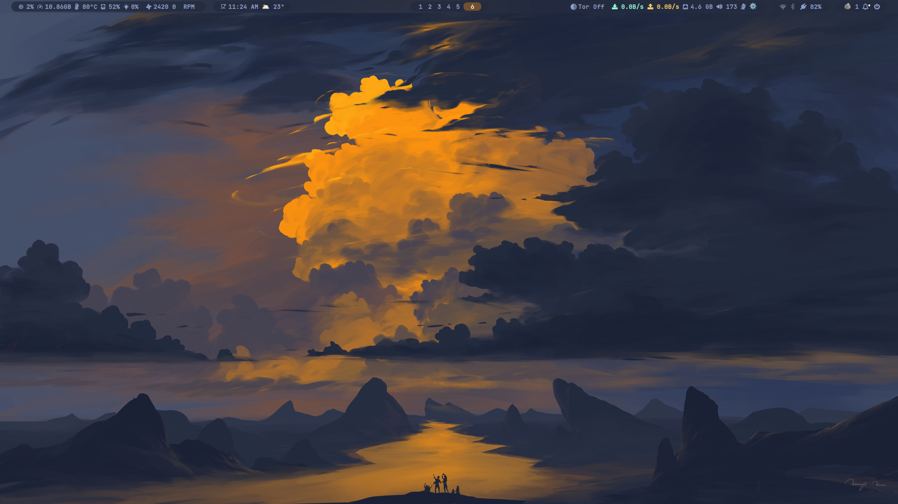
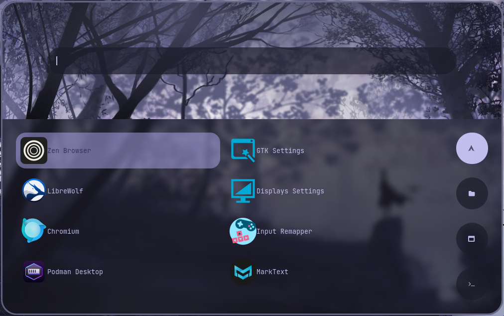

# HyDE - Hyprland Desktop Environment Setup

HyDE is a comprehensive setup for a beautiful and functional Hyprland desktop environment on Arch Linux. It includes dotfiles, scripts, and installation automation for a complete rice with themes, tools, and plugins(pyprland and hyprpm).

## Features

- **Modular Installation**: Interactive setup with selective component installation.
- **Dotfiles**: Pre-configured Hyprland, Waybar, Dunst, Kitty, and more.
- **Themes**: Catppuccin color scheme with custom fonts and cursors.
- **Tools**: Neovim with AstroNvim, Pyprland plugins, zoxide, and more.
- **Scripts**: Custom scripts for wallpapers, quotes, battery, etc.

## Screenshots






## Prerequisites

- Arch Linux (or compatible)
- Basic system with pacman and yay (AUR helper)
- Root access for some configurations (e.g., greetd)

## Quick Start

1. Clone the repository:

   ```bash
   sudo pacman -S git
   ```

1. Clone the repository:

   ```bash
   git clone --depth 1 https://github.com/niru124/Hypr.git
   cd HyDE
   ```

1. Run the main installer:

   ```bash
   ./install_all.sh
   ```

   Follow the y/n prompts to select components.

## Installation Scripts

The main script `install_all.sh` orchestrates the setup by calling modular scripts based on user confirmation. Order of execution:

1. **Core Packages** (`install_core.sh`): Installs essential pacman packages (all), optional AUR packages (fzf selection), copies dotfiles, scripts, installs zoxide.
2. **Non-Essential Packages** (`install_non_essential.sh`): Interactive fzf selection from non-essential.txt for additional AUR packages.
3. **Fonts** (`install_fonts.sh`): Installs Nerd Fonts (CaskaydiaCove, 0xProto, JetBrainsMono) and custom fonts (Abocat, Steelfish Outline, Mexcellent).
4. **Pyprland** (`pyprland.sh`): Installs Pyprland from AUR.
5. **TUI Greet Configuration** (`tui_greet.sh`): Configures greetd with tuigreet for Hyprland login.
6. **AstroNvim** (`install_astronvim.sh`): Sets up Neovim with AstroNvim configuration.
7. **Non-Essential Packages** (optional rerun of `install_non_essential.sh`).
8. **Hyprpm Plugins** (optional `install_hyprpm_plugins.sh`).

## Individual Scripts

Run specific scripts directly for partial setups:

- `./install_core.sh`: Core setup with package installation and dotfiles.
- `./install_non_essential.sh`: Additional packages with selection.
- `./install_fonts.sh`: Font installation.
- `./pyprland.sh`: Pyprland installation.
- `./tui_greet.sh`: Greetd configuration (requires sudo).
- `./install_astronvim.sh`: AstroNvim setup.
- `./pacman_necessary.sh`: Install all pacman packages from pacman_necessary.txt.
- `./yay_necessary.sh`: Select and install AUR packages from yay_necessary.txt with fzf.

## Configuration

- Dotfiles are in `Config/.config/`.
- Scripts are in `bin2/` (copied to `~/.local/share/bin/`).
- Wallpapers and assets in `assets/`.
- Customize themes in `Config/.config/themes/`.

## Keybindings and Usage

- Hyprland keybindings: Check `Config/.config/hypr/hyprland.conf`.
- Waybar modules: Custom scripts in `~/.local/share/bin/`.
- Wallpaper: Use `wall` script for dynamic wallpapers and wallpapers are stored in `~/.config/hyde/themes/`.
- Quotes: Random quotes on lock screen from `quotes.json`.
