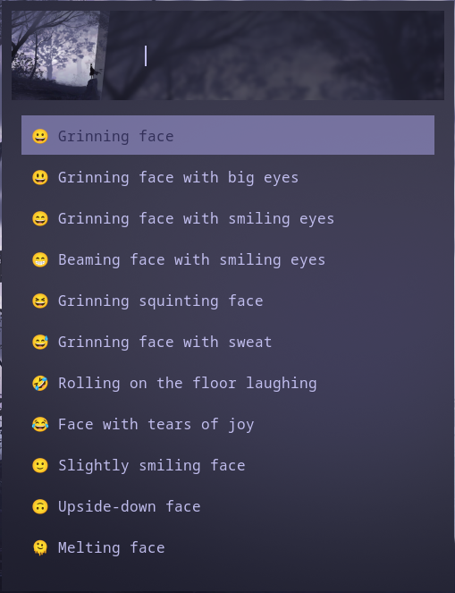
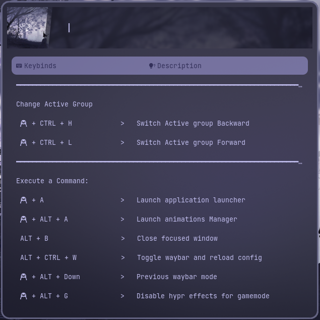

## HyDE - A Dynamic Hyprland Environment

**HyDE** is a comprehensive, intelligent, and highly dynamic configuration for the Hyprland Wayland compositor. It aims to provide a feature-rich, aesthetically pleasing, and deeply integrated desktop experience by automating theming, component configuration, and user feedback.

Built around modular and powerful shell scripts, **HyDE** manages everything from the status bar to window borders, creating a seamless, cohesive environment.

---

## ✨ Features

- **Dynamic Theming**
  Window borders and other UI elements adapt to your wallpaper's color palette using tools `ImageMagick` or custom logic.

- **Modular & Switchable Waybar**
  Easily switch between multiple Waybar layouts on the fly. Configurations and modules are dynamically generated.

- **Interactive Keybinding Helper**
  A searchable, Rofi-based cheat sheet for your keybindings — automatically generated from your Hyprland config.

- **Custom Login Manager**
  Includes a themed `tuigreet` setup that blends beautifully with your overall environment.

- **Pre-configured Applications**
  Comes bundled with tuned configs for:
  
  - **Neovim**
  - **Yazi**
  - **Cava**
  - **Kitty**
  - **Hyprsunset**
  - And more...

- **Pyprland Plugin Support**
  Pre-installed and configured with:

- `scratchpad` (Yazi, floating terminal, Cava)

- `center` layout for better small-screen usage

- Extend easily via `~/.config/hypr/myenv/pyprland.toml`

---

## 📸 Screenshots and Videos

### Screenshots

#### Overall Layout


#### Dwindle Layout


#### Scrolling Layout


#### Hyprlock


#### Rofi

##### App Launcher


##### ****Laucher Picker


##### ****Animation Picker


##### Calculator


##### Clipboard


##### Drive


##### Emoji Picker



##### Key Pass


##### Keybindings



##### Logout


##### Timer


##### To-Do List


##### Wallpaper Picker


##### Wifi Menu


#### Waybar


### Videos

#### Scratchpad

<video src="assets/videos/scratchpad.mkv" controls></video>

#### Scratchpad 2

<video src="assets/videos/scratchpad2.mkv" controls></video>

---

## Installation

> Ensure that `git` are already installed before starting.
> or install using `sudo pacman -S git`

Clone the repo and run the installer:

```bash
git clone https://github.com/niru124/Hypr.git
cd HyDE/
chmod +x install_all.sh
./install_all.sh
```

This interactive script will guide you through the installation process, prompting you to confirm each major component:

- **Core Packages**: Updates your system, installs essential packages (Pacman + AUR), copies core configuration files to `~/.config`, sets up custom scripts in `~/.local/share/bin`, and installs `zoxide`.
- **Non-Essential Packages**: Installs additional packages from `non-essential.txt`.
- **Fonts**: Installs Nerd Fonts (CaskaydiaCove, 0xProto, JetBrainsMono) and custom fonts (Abocat, Steelfish Outline, Mexcellent).
  
  > **Note:** For custom fonts, you may need to update the placeholder download URLs in `install_all.sh` with direct `.zip` links.
- **GTK Theme**: Installs the Catppuccin GTK Theme and configures Flatpak access.
- **Pyprland**: Installs Pyprland in a dedicated Python virtual environment.
- **TUI Greet Configuration**: Configures the `tuigreet` display manager.
  
  > **Note:** This step requires `sudo` privileges.
- **AstroNvim**: Installs the AstroNvim Neovim configuration (requires Neovim v0.7+ and Nerd Fonts to be pre-installed).

---

## Directory Structure

```bash
HyDE/
├── install_all.sh          # Main interactive installation script
├── astrovim_install(extra).sh # AstroNvim installation script
├── packages.txt            # Pacman packages list
├── packages2.txt           # AUR (yay) packages list
├── non-essential.txt       # Non-essential AUR (yay) packages list
├── Config/
│   └── .config/            # All Hyprland-related dotfiles
├── bin2/                   # Custom helper scripts
```

---

## ⚙️ Extend Pyprland Plugins

To add more plugins, edit:

```bash
~/.config/hypr/pyprland.toml
```

other plugins and configurations could be found at https://hyprland-community.github.io/pyprland/Plugins.html

---

## Summary

- This environment is tailored for **power users**, but easy enough for beginners to explore.
- Most of the configuration is commented and self-documented.
- Additional instructions for customizing keybindings, layouts, and plugin behavior can be found inside the respective `.config` directories.
